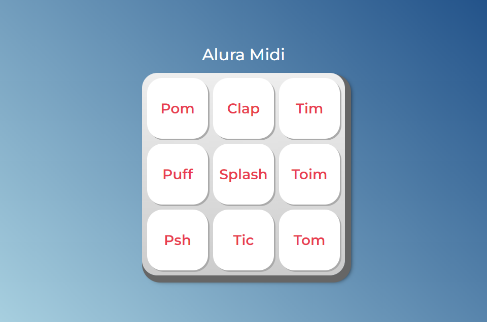

# <h1 align="center">Site AluraMidi</h1>
 

<h2 align="center"> Descrição do Projeto </h2>
 

    Site desenvolvido pela instrutora da Alura quem ministrou o curso "JavaScript para Web: Crie páginas dinâmicas". 
     
    A publicação deste site foi efetuada neste repositório GitHub com o propósito de demonstrar os conhecimentos adquiridos para tornar uma página dinâmica com JavaScript.

 

<h2 align="center"> :hammer:  Ferramentas e Funcionalidades  :hammer: </h2>
 

      

 

    Ao clicar no botão com o nome do som, a página o reprozuz. 
 

 
          
<h2 align="center"> :notebook:  O que Aprendi  :notebook:</h2>

 - Associar o JavaScript com HTML através do DOM;
 - Implementar funções com JavaScript;
 - Selecionar operadores lógicos adequados para diferentes situações;
 - Refatoração de código;
 
 
 
<h2 align="center"> :heart:  Contato  :heart:</h2>
 

regothardo@gmail.com
